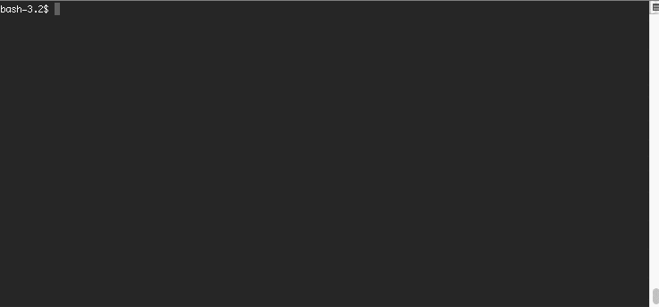

# [Roc](http://www.getroc.org)


Build JavaScript projects easily using modern libraries.

Quickly create products powered by libraries like [Koa](http://koajs.com/), [React](http://facebook.github.io/react/) and [Redux](https://github.com/reactjs/redux) ready for deployment in production with minimal additional setup. Tools like [Webpack](https://github.com/webpack) and [Babel](https://babeljs.io/) power the build process.


[](https://www.npmjs.com/package/roc)
[](https://travis-ci.org/rocjs/roc)
[](https://coveralls.io/github/rocjs/roc?branch=master)
[](https://codeclimate.com/github/rocjs/roc)
[](https://david-dm.org/rocjs/roc)  
_Currently supports Linux and OS X_

## Roc provides
- Command Line Interface (CLI) for creating and managing your project
- Consistent configuration and runtime management
- Minimized complexity within projects by combining powerful modules together
- A way to eliminate boilerplate code within your projects
- Best in class developer tools ready to be used instantly

All of this is provided by a flexible extension system, and several extensions are available today.

### Examples of what can be done today
- Production ready React applications
- Generic server applications
- Generic web applications
- JavaScript modules ready for npm and browser

More will be possible in the future and creating your own extension is easy.

## Creating a React application with Roc
```
$ npm install -g roc
$ roc new react-app web-app-react
$ cd react-app && roc dev
```


This will:
* Install Roc
* Create a project that uses React and Redux
* Start the project in development mode

### Production ready
To build and run in production just use:
```
$ roc build
$ roc start
```

### Where to go from here
A very common use-case is to make modifications to your `roc.config.js`. To get a better understanding of all the possible options in the package use the `roc list-settings` command or `--help` for a specific command.

## Not a boilerplate!
Roc uses templates to initialize new projects.
Templates are very thin skeletons that depend on Roc extensions that manage the typical boilerplate. Meaning only your own code will leave a significant footprint in your project. This allows you to maintain a very clean separation of concerns as your projects evolve.

Official Roc extensions are semantically versioned and will include changelogs compiling change summaries, making upgrade paths much simpler across your projects.

## Minimal lock-in
Roc tries to stay out of your way as much as possible and most extensions will not introduce any Roc-specific interfaces. Your project will still use your favourite libraries in the same way as you normally would.

## Current Official Packages & Plugins
[See the repositories under this organisation](https://github.com/rocjs)

## Documentation
See the [documentation](/docs/README.md).

## Motivation
Roc was born out of the need to create modern applications following the correct conventions and using best practices consistently.

We quickly realized that keeping boilerplate updated within each project over time was unmanageable. It seems natural to have this _repeated complexity managed by separated semantically versioned packages_. 

[See this article for a more in-depth overview of the reasoning behind Roc.](https://medium.com/@arsovik/rethinking-modern-javascript-development-6aee92b860aa)

Development of Roc was started before these posts where created but they still describe what Roc aims to solve in a good way:

* [Challenge: Best JavaScript Setup for Quick Prototyping](http://blog.vjeux.com/2015/javascript/challenge-best-javascript-setup-for-quick-prototyping.html) by [**@vjeux**](https://github.com/vjeux)
* [Javascript Fatigue](https://medium.com/@ericclemmons/javascript-fatigue-48d4011b6fc4) by [**@ericclemmons**](https://github.com/ericclemmons)

## Versioning and stability
Roc follows semantic versioning and is currently pre-release software. We hope to release 1.0.0 before summer 2016.

## Contribute
We are open to, and grateful for, any contributions made by the community.

## Thanks
Thanks to [Jongleberry](https://github.com/jonathanong) for letting us use the `roc` package name on npm.
